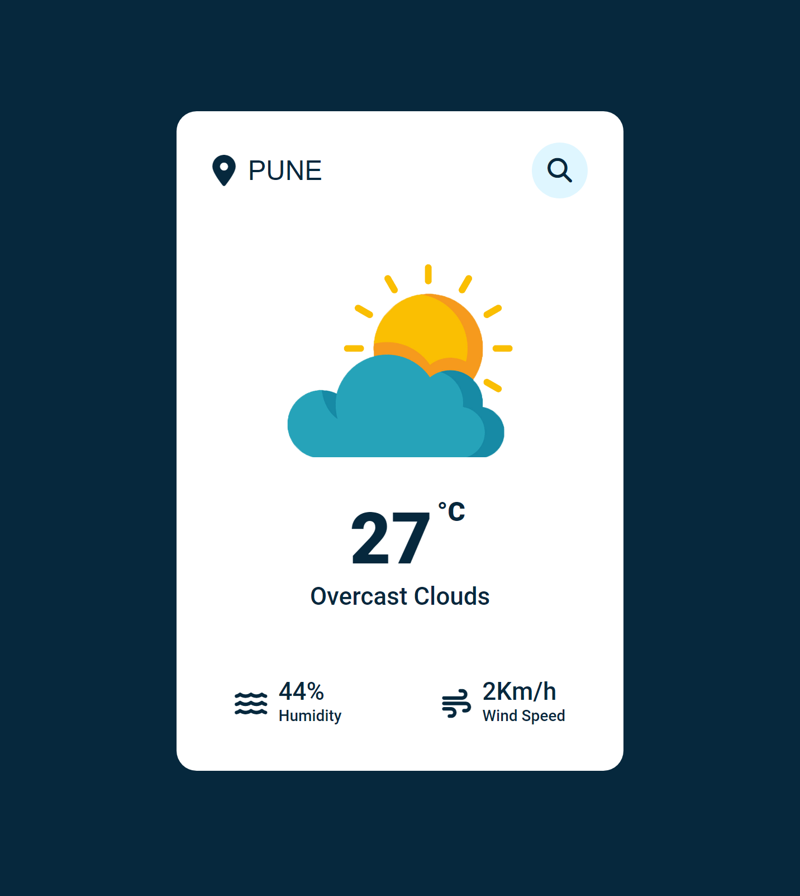

# Weather App
A simple Weather App built on HTML, CSS and JavaScript.

Steps to run project:
1. Goto `https://openweathermap.org/` and create an ancount.
2. Get your api key.
3. Replace your api key in index.js file on line 9.
```javascript
const APIKey = 'Your Api Key';
```

Screenshot:
